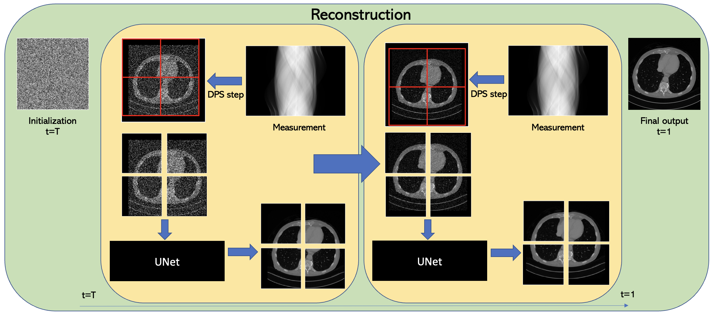

## Learning Image Priors through Patch-based Diffusion Models for Solving Inverse Problems<br><sub>Official PyTorch implementation</sub>

Our work has been accepted to [Neurips 2024](https://nips.cc/virtual/2024/poster/95843). 



**Learning Image Priors through Patch-based Diffusion Models for Solving Inverse Problems**<br>
Jason Hu, Bowen Song, Xiaojian Xu, Liyue Shen, Jeffrey A. Fessler
<br>https://arxiv.org/abs/2406.02462 <br>

Abstract: *Diffusion models can learn strong image priors from underlying data distribution and use them to solve inverse problems, but the training process is computationally expensive and requires lots of data. Such bottlenecks prevent most existing works from being feasible for high-dimensional and high-resolution data such as 3D images. This paper proposes a method to learn an efficient data prior for the entire image by training diffusion models only on patches of images. Specifically, we propose a patch-based position-aware diffusion inverse solver, called PaDIS, where we obtain the score function of the whole image through scores of patches and their positional encoding and utilize this as the prior for solving inverse problems. First of all, we show that this diffusion model achieves an improved memory efficiency and data efficiency while still maintaining the capability to generate entire images via positional encoding. Additionally, the proposed PaDIS model is highly flexible and can be plugged in with different diffusion inverse solvers (DIS). We demonstrate that the proposed PaDIS approach enables solving various inverse problems in both natural and medical image domains, including CT reconstruction, deblurring, and superresolution, given only patch-based priors. Notably, PaDIS outperforms previous DIS methods trained on entire image priors in the case of limited training data, demonstrating the data efficiency of our proposed approach by learning patch-based prior.*


## Requirements
* Python libraries: See [environment.yml](./environment.yml) for exact library dependencies.
* Also see [odl_env.yml](./odlstuff/odl_env.yml) for help on installing ODL package for running CT experiments.

## Getting started
First, create a folder called `training-runs` in the base directory. This will be where checkpoints are stored.

*Please note that training and reconstruction of colored images is currently not supported but will be updated soon. Thanks for your patience!*

### Preparing datasets
The simplest way to use a custom dataset is to use a mat file. As specified on line 81 of [training_loop.py](./training/training_loop.py), the mat file should have a variable called 'images' storing all the grayscale images in a single 3D array. The first two dimensions should be the image size, and the third dimension should be the number of total training images. For larger datasets and other ways to process data, see [dataset.py](./training/dataset.py) for alternate data loader options.

### Train Patch Diffusion

You can train new models using `train.py`. For example:

```.bash
# Train DDPM++ model using 4 GPUs with batch size of 16
torchrun --standalone --nproc_per_node=4 train.py --outdir=training-runs --data=mydata --cond=0 --arch=ddpmpp --batch=16 --lr=1e-4 --dropout=0.05 --augment=0 --real_p=0.5 --padding=1 --tick=2 --snap=10 --pad_width=64

```

Please see [train.py](./train.py) for more information on the hyperparameters.

### Image Reconstruction

After the checkpoint has been trained, perform image reconstruction with `inverse_nodist.py`. Create a new directory called image_dir containing png files consisting of the testing dataset; the reconstruction algorithm will be run on all images inside this directory. For example:
```.bash
# Perform 20 view CT reconstruction
python3 inverse_nodist.py --network=training-runs/67-ctaxial/network-snapshot-000800.pkl --outdir=results --image_dir=image_dir --image_size=256 --views=20 --name=ct_parbeam --steps=100 --sigma_min=0.003 --sigma_max=10 --zeta=0.3 --pad=24 --psize=56

```

Here is one checkpoint for [CT images](https://drive.google.com/file/d/1fJOcqnOw3EFPKj9vX_hdGvB8r-Oz4_yJ/view?usp=sharing).

## Citation

```
@article{hu2024padis,
  title={Learning Image Priors through Patch-based Diffusion Models for Solving Inverse Problems},
  author={Hu, Jason and Song, Bowen and Xu, Xiaojian and Shen, Liyue and Fessler, Jeffrey A.},
  journal={arXiv preprint arXiv:2406.02462},
  year={2024}
}
```

## Acknowledgments

We thank the [Patch-Diffusion](https://github.com/Zhendong-Wang/Patch-Diffusion) authors for providing a great code base.
